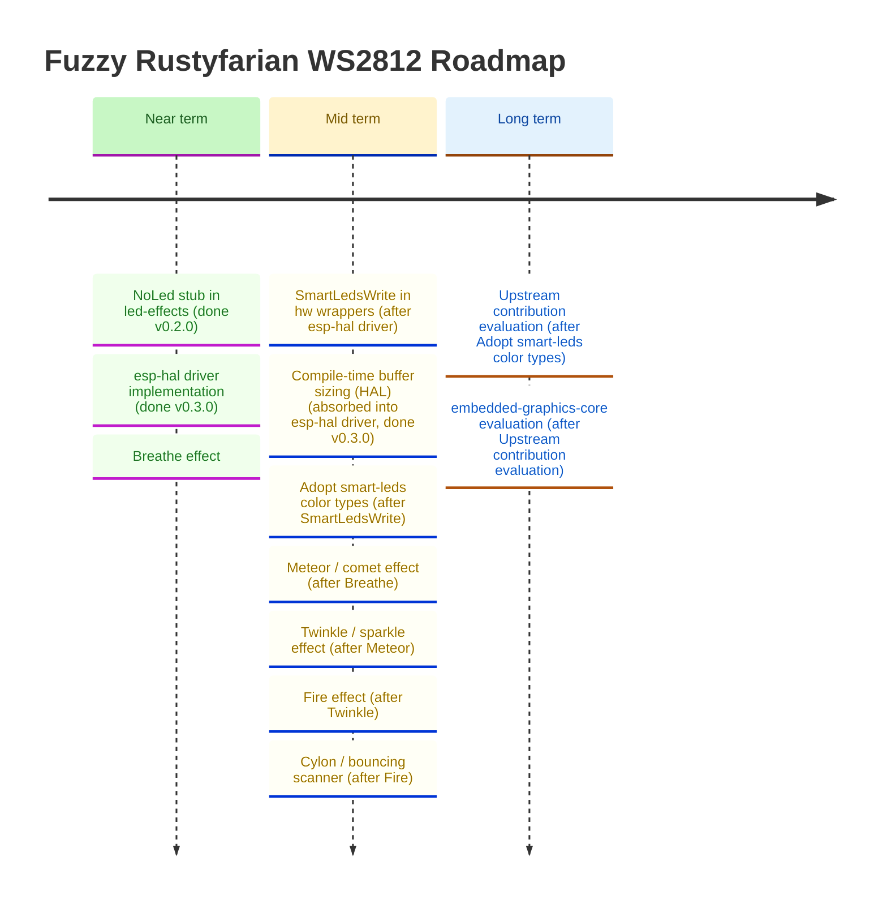

# Roadmap

*Last updated: March 2026*

This roadmap is informed by the [ecosystem comparison](ecosystem-comparison.md) conducted in February 2026.
Items are grouped by theme and ordered roughly by impact and dependency.
Vision review (March 2026) refocused near-term priority on `NoLed` → `esp-hal` driver → ecosystem integration.

## Ecosystem Integration

### Implement `SmartLedsWrite` in hardware wrapper crates

The `smart-leds-trait` crate is the de-facto ecosystem standard.
Implementing `SmartLedsWrite` (and `SmartLedsWriteAsync`) in `rustyfarian-esp-idf-ws2812` and `rustyfarian-esp-hal-ws2812` would:

- Let consumers use the `brightness()` and `gamma()` iterators from `smart-leds` without any conversion code
- Make the hardware wrappers composable with any other `smart-leds`-based effect crate
- Align the project with the wider embedded Rust LED ecosystem

Dependency: none.

### Adopt `smart-leds-trait` color types in pure crates

`smart-leds-trait` re-exports `rgb::RGB8`, `rgb::RGBW`, and related types.
Aligning `ws2812-pure` and `ferriswheel` with these types (or providing `From`/`Into` conversions) would make effect output directly consumable by any `SmartLedsWrite` driver without manual mapping.

Dependency: `SmartLedsWrite` implementation above.

---

## Hardware Driver Improvements

### Implement `rustyfarian-esp-hal-ws2812` driver ✓ done (v0.3.0)

The `rustyfarian-esp-hal-ws2812` crate implements a full WS2812 RMT driver using `esp-hal 1.0.0`.
It targets ESP32-C6 (RISC-V, `riscv32imac-unknown-none-elf`) and is bare-metal `no_std`.
All color logic delegates to `ws2812-pure`; the const-generic `N` buffer sizing was absorbed from the item below.

### Compile-time buffer sizing in the ESP-HAL wrapper ✓ absorbed into driver (v0.3.0)

The `rustyfarian-esp-hal-ws2812` driver ships with a `buffer_size(num_leds)` const helper
and a `const N: usize` generic parameter, catching sizing errors at compile time.
This item is fully implemented as part of the driver.

<strong>Implement <code>NoLed</code> stub in <code>led-effects</code> ✓ done (v0.2.0)</strong>

`NoLed` is a zero-size `StatusLed` implementor with `type Error = Infallible`,
satisfying the trait in applications that have no physical status LED.
See the v0.2.0 CHANGELOG entry for details.

---

## Animation Effects (`ferriswheel`)

The current `ferriswheel` crate provides seven well-tested, ring-specific effects:
`RainbowEffect`, `PulseEffect`, `SpinnerEffect`, `ChaseEffect`, `FlashEffect`, `ProgressEffect`, and `SectionEffect`.
The ecosystem survey identified the following as good candidates for the backlog —
each would need ring-geometry-aware implementation and full test coverage.

### Breathe effect

A smooth sinusoidal brightness envelope applied to a solid color.
Similar to the existing `PulseEffect` but operates on a configurable base color rather than a hue cycle.

### Fire effect

A heat-map simulation with randomised flickering decay from a "hot" base upward through the ring.
Requires a per-LED temperature buffer and a decay function.

### Meteor / comet effect

A bright "head" with a fading tail that travels around the ring.
Requires wrap-around index arithmetic already established in the ring geometry model.

### Twinkle / sparkle effect

Random LEDs briefly illuminate at peak brightness then decay.
Good for ambient/idle states.

### Cylon / bouncing scanner effect

A single bright LED (or small cluster) sweeps back and forth across the ring, automatically reversing direction.
Note: `ChaseEffect` already covers unidirectional scanning; this adds the auto-bounce behaviour.

---

## Long-term / Strategic

### Evaluate upstream contribution to `smart-leds-rs`

The pure-logic crates (`ws2812-pure`, `ferriswheel`) represent a gap in the ecosystem:
no existing `smart-leds-rs` crate provides ring-geometry animations testable without hardware.
Once the APIs are stable, evaluate whether proposing these as upstream additions or companion crates makes sense.
Decision should follow a stability review and user feedback.

### Evaluate `embedded-graphics-core` integration for matrix displays

`ws2812-esp32-rmt-driver` demonstrated a clean `embedded-graphics-core` drawing target
for addressing LEDs as a 2D pixel grid.
If a matrix display use-case emerges, this pattern provides a ready-made approach.
Not a near-term priority — track as a future option.
