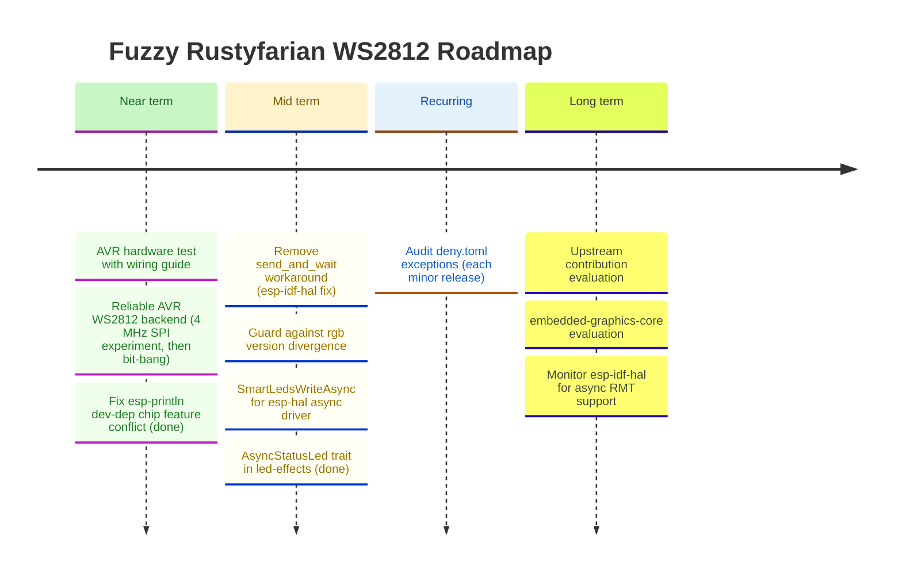

# Roadmap

*Last updated: May 2026*

This roadmap is informed by the [ecosystem comparison](ecosystem-comparison.md) conducted in February 2026.
The AVR WS2812 driver (`rustyfarian-avr-ws2812`) was code-complete in March 2026 across three phases:
SPI encoding in `ws2812-pure`, the `embedded-hal 1.0` hardware wrapper, and build validation against `avr-none`.
Hardware bring-up in May 2026 surfaced an SPI prerendered encoding limitation; a follow-up driver strategy (4 MHz SPI experiment, then cycle-counted `asm!` bit-bang) is now the active near-term focus.

## Build Fixes

### ~~Fix `esp-println` dev-dependency chip feature conflict~~ — Done

Moved `esp-println` from `[dev-dependencies]` (with hardcoded `esp32c6` feature) to `[dependencies]`
as an optional dep with per-chip feature forwarding (`esp-println?/esp32c6`, `esp-println?/esp32c3`, `esp-println?/esp32`).
Build scripts updated to include `esp-println` in base HAL features.
Also fixed all 11 blocking examples: `Ws2812Rmt::<N>` → `Ws2812Rmt::<_, N>` (pre-existing breakage from v0.4.0 async type parameter).

---

## Ecosystem Integration

### Recurring: audit `deny.toml` exceptions

Each ignored advisory or per-crate license exception in [`deny.toml`](../deny.toml)
should be re-checked periodically — the underlying upstream bug, deprecation, or
licensing situation may have been resolved, in which case the exception can be
removed and the dep graph cleans up.

Current entries (as of 2026-05):

- `RUSTSEC-2024-0436` — `paste` unmaintained; transitive through `esp-hal 1.0.0` /
  `riscv 0.15.0`. Re-check when those crates bump or when a successor proc-macro
  ships in the smart-leds / esp-rs ecosystem.

(The `bare-metal` / `atdf2svd` exceptions previously needed for `rustyfarian-avr-ws2812`
were eliminated 2026-05 by switching the bit-bang backend to raw `cli` + `SREG`
save/restore inline asm, dropping the `avr-device` dependency entirely.)

Cadence: revisit at every minor release, or when a new exception is added.
Mechanism: walk each entry, run `cargo update` against the relevant upstream, and
attempt to remove the exception. If the advisory or licence still fires, leave it
in place but refresh the rationale comment with the current upstream state.

### Guard against `rgb` version divergence between `ferriswheel` and `smart-leds-trait`

If `smart-leds-trait` ever bumps to `rgb v0.9`, the two `RGB8` types would silently
diverge and users would see confusing type-mismatch errors at the `SmartLedsWrite`
call site rather than a clean version-conflict at `cargo update` time.
Mitigation: add `smart-leds-trait` as an optional dependency in `ferriswheel`
(e.g. `smart-leds-compat = ["dep:smart-leds-trait"]`).
Cargo would then surface the version conflict at resolve time rather than at the
user's build site.
Purely defensive — not urgent until `smart-leds-trait` signals an `rgb` bump.

---

## Hardware Driver Improvements

### Remove `send_and_wait` workaround when `esp-idf-hal` fixes `EncoderWrapper`

`esp-idf-hal 0.46.2` has a bug in `EncoderWrapper`: the `From<rmt_encode_state_t>` conversion
panics on bitwise-OR'd flag values (e.g. `COMPLETE | MEM_FULL = 0x03`) that the C encoder
legitimately returns.
Since the encode callback runs in ISR context, the panic triggers `abort()`.
We work around this by using `start_send` + `wait_all_done` directly with the C-side
`BytesEncoder`, bypassing the Rust `EncoderWrapper` entirely.
When a future `esp-idf-hal` release fixes this (likely by treating `rmt_encode_state_t` as
a bitfield rather than an enum), switch back to `send_and_wait` and remove the `transmit_bytes`
helper and its `unsafe` block.
Track: [esp-idf-hal GitHub issues](https://github.com/esp-rs/esp-idf-hal/issues).

### Implement `SmartLedsWriteAsync` for `Ws2812Rmt<'d, Async, N>`

The `smart-leds-trait` ecosystem defines a `SmartLedsWriteAsync` trait for async LED writers.
`rustyfarian-esp-hal-ws2812` already implements `SmartLedsWrite` for the blocking variant.
Adding `SmartLedsWriteAsync` for the async variant completes the `smart-leds` integration
and allows users to apply `brightness()` and `gamma()` adapters in async contexts.
Blocked on: `SmartLedsWriteAsync` trait stabilisation in the `smart-leds` ecosystem.
See [ADR 006](adr/006-async-support.md) and [ADR 008](adr/008-embassy-as-async-runtime.md).

### ~~Evaluate `AsyncStatusLed` trait in `led-effects`~~ — Done

`AsyncStatusLed` trait added to `led-effects` with `async fn set_color`.
`NoLed` implements it. `Ws2812Rmt<'d, Async, N>` implements it behind `async` + `led-effects` features.
No new dependencies — uses only `core::future::Future` (Rust 1.75+, `#![allow(async_fn_in_trait)]`).
Three async pulse examples added: `hal_c3_pulse_async`, `hal_c6_pulse_async`, `hal_esp32_pulse_async`.

---

## Animation Effects (`ferriswheel`)

The current `ferriswheel` crate provides more than a dozen well-tested, ring-specific effects:
`RainbowEffect`, `PulseEffect`, `BreatheEffect`, `SpinnerEffect`, `MeteorEffect`, `TwinkleEffect`, `FireEffect`, `CylonEffect`, `KnightRiderEffect`, `ChaseEffect`, `FlashEffect`, `ProgressEffect`, `SectionEffect`, and `RainbowCometEffect`.

### Deferred follow-ups

Small improvements deferred during reviews.
Not blocking, but tracked here to avoid being lost.

- **`MeteorEffect` decay math: `/255` vs fixed-point `>> 8`** — current `brightness * decay / 255`
  maps decay values directly to percentages and keeps `decay=0` = instant black.
  The `* (decay + 1) >> 8` fixed-point variant is marginally faster on bare metal but changes
  the semantics of `decay=0` (near-zero, not instant black), requiring test updates.
  Revisit only if a performance need or a `with_decay_pct(f32)` builder is added.

- **`position: u8` hidden constraint in all positional effects** — `SpinnerEffect`, `ChaseEffect`,
  `RainbowEffect`, and `MeteorEffect` all store `position: u8`; `advance_position` also returns `u8`.
  With `MAX_LEDS = 256` the cast is lossless today (positions 0-255 map exactly), but raising
  `MAX_LEDS` above 256 would silently truncate.
  Fix is crate-wide: change `advance_position` + all four `position` fields to `usize`.
  Not urgent until `MAX_LEDS` increases.

### FireEffect follow-ups

Small improvements identified during review. Not blocking, tracked to avoid being lost.

- **Parameterise ignition base range** — `with_base_range(u8)` builder; currently hardcoded to `n.min(3)`, which is fine for small rings but too narrow for long strips (60+ LEDs). A proportional default (e.g. `(n / 10).max(3)`) or explicit setter would make large-strip fire look more natural.

- **Ring wrap-around diffusion** — `with_wrap(bool)` flag to feed `heat[n-1]` back into `heat[0]` during diffusion, enabling a true circular topology where the "tip" and "base" are adjacent. Changes the visual character significantly — the current linear model (base at index 0) is correct for a strip; wrap-around suits a true ring where the flame is symmetric.

- **Gradient parameterisation** — `with_gradient(&'static [GradientStop])` for users who want a custom palette (e.g. blue ice, purple plasma). Requires a `GradientStop` type and piecewise-linear interpolation in `fire_color`. `no_std`-safe with a fixed-size slice; `Vec` is off the table.

---

## Long-term / Strategic

### Evaluate upstream contribution to `smart-leds-rs`

The pure-logic crates (`ws2812-pure`, `ferriswheel`) represent a gap in the ecosystem:
no existing `smart-leds-rs` crate provides ring-geometry animations testable without hardware.
Once the APIs are stable, evaluate whether proposing these as upstream additions or companion crates makes sense.
Decision should follow a stability review and user feedback.

### ATmega328P / AVR WS2812 support (`rustyfarian-avr-ws2812`) — Complete

A third hardware driver targeting `avr-none` (with `-C target-cpu=atmega328p`) using the SPI
prerendered approach (no inline assembly required).
See [AVR WS2812 Research](research-avr-ws2812.md) for the full feasibility assessment.

**Phased approach:**

1. ~~**Add `prerender_spi` to `ws2812-pure`**~~ — **Done.**
   Pure `no_std` function encoding `&[RGB8]` into a WS2812 SPI byte buffer (`12 × num_leds` bytes, reset sent separately).
   Includes `spi_data_len()`, `SpiEncodeError`, `SPI_RESET_BYTES_2MHZ`, and 14 unit tests + 1 doc test.
2. ~~**Add `rustyfarian-avr-ws2812`**~~ — **Done.**
   Thin wrapper holding an `embedded-hal 1.0` `SpiBus`, calling `prerender_spi`.
   Generic over `SpiBus`; caller wraps in `avr_device::interrupt::free` at the call site.
   Includes `Ws2812Spi`, `SpiError`, `spi_buffer_size`, 7 unit tests + 1 doc test.
3. ~~**AVR CI / build validation**~~ — **Done.**
   `just check-avr` (host), `just check-avr-target` (real `avr-none` with `-C target-cpu=atmega328p`).
   Setup recipes: `just setup-avr` installs `nightly-2025-04-27` + `rust-src`.
   `just setup` installs all targets and tools.

**Key constraints:**
- Permanent nightly dependency (Tier 3 target, no stable path)
- GNU AVR toolchain required (`avr-gcc`, `avr-binutils`, `avr-libc`)
- 2 KB SRAM limits practical LED count (~60 LEDs max, 12-LED ring is comfortable at 144 bytes)
- `ws2812-spi` still targets `embedded-hal 0.2`; `avr-hal` is on 1.0 — version mismatch means
  implementing SPI encoding ourselves (in `ws2812-pure`) rather than depending on `ws2812-spi`

**Do not adopt:** `ws2812-avr` (GPL, unstable `generic_const_exprs`, near-zero maintenance).
**Do not attempt:** pure-Rust bitbang without assembly — timing margins too tight at 16 MHz.

### AVR hardware test with a wiring guide

End-to-end validation of `rustyfarian-avr-ws2812` on real hardware.

Deliverables:

- ~~**Wiring and flashing guide**~~ — **Done.** Combined into [`docs/avr-getting-started.md`](avr-getting-started.md): pin connections, data line resistor, decoupling capacitor, toolchain setup (Rust nightly + GNU AVR + ravedude), build and flash pipeline.
- ~~**Minimal example**~~ — **Done.** `examples/avr-nano-rainbow/` — standalone project using `avr-hal`'s SPI with `Ws2812Spi`, demonstrating the full stack from `ferriswheel` `RainbowEffect` → `prerender_spi` → SPI hardware → LEDs.
- **Smoke test confirmation** — **Blocked by encoding issue.** Hardware testing on 2026-05-04 (both CH340 Nano clone and genuine Arduino Nano with the same WS2812 strip that runs cleanly on ESP32) revealed the SPI prerendered encoding produces stable white-ish output with chain misalignment. Root cause documented in [`docs/key-insights.md`](key-insights.md) "AVR WS2812 Driver: SPI Prerendered Encoding Limitation". External research saved to [`docs/research-avr-ws2812-driver-options.md`](research-avr-ws2812-driver-options.md). Continued under "Reliable AVR WS2812 backend" below.

### Reliable AVR WS2812 backend (4 MHz SPI experiment, then bit-bang)

The 2 MHz SPI prerendered encoding emits `T0H = 500 ns` (at the WS2812B "0/1" decision threshold) and `T1H = 1500 ns` (well above the 0.85 µs nominal max), making bit interpretation unreliable on strips with tighter tolerance.

Two-track plan (full design: [`docs/features/avr-bitbang-driver.md`](features/avr-bitbang-driver.md)):

1. **Track A — 4 MHz SPI experiment** (one-line change). Switch `OscfOver8` → `OscfOver4`. Brings `T0H` to 250 ns (mid-spec) and `T1H` to 750 ns (in spec). 5-minute hardware test on the same failing strip.
   - If it works on the failing strip → ship as the default; record decision in an ADR; close this roadmap entry.
   - If it fails → proceed to Track B.
2. **Track B — Cycle-counted `asm!` bit-bang backend.** Add a `bitbang` feature flag with timings matching `Adafruit_NeoPixel`'s proven ATmega328P @ 16 MHz approach (T0H = 4 cycles, T1H = 8 cycles, total 20 cycles per bit = 1.25 µs exact). Disables global interrupts during write. Documented as the canonical working approach for AVR WS2812 from external research.

**Resolved (2026-05-04):** [ADR 007 — AVR WS2812 Driver Strategy](adr/007-avr-ws2812-driver-strategy.md) — cycle-counted bit-bang adopted as the recommended backend; SPI prerendered backend retained as opt-in.
Production `Ws2812BitBang` driver landed in `rustyfarian-avr-ws2812` behind the `bitbang` feature, hardware-validated against `ferriswheel::PulseEffect`. `SmartLedsWrite` implemented for both backends (feature `smart-leds-trait`).
This roadmap entry is complete and will be moved to the changelog at the next release cut.

Requires physical hardware: ATmega328P board (Arduino Nano/Uno) and the same WS2812 strip used during the 2026-05-04 bring-up so we're testing against a known-failing baseline.

### Monitor `esp-idf-hal` for async RMT support

`rustyfarian-esp-idf-ws2812` is blocking-only because `esp-idf-hal 0.46`'s `TxChannelDriver`
has no async API.
If a future `esp-idf-hal` release adds async RMT (likely using `esp-idf-svc`'s executor or
`tokio`, not Embassy), async support can be added to the IDF driver under a separate feature flag.
This would be a different runtime from the HAL driver's Embassy-based async (see [ADR 008](adr/008-embassy-as-async-runtime.md))
— the two drivers already diverge on error handling (ADR 005), so runtime divergence is expected.
Track: [esp-idf-hal releases](https://github.com/esp-rs/esp-idf-hal/releases).

### Evaluate `embedded-graphics-core` integration for matrix displays

`ws2812-esp32-rmt-driver` demonstrated a clean `embedded-graphics-core` drawing target
for addressing LEDs as a 2D pixel grid.
If a matrix display use-case emerges, this pattern provides a ready-made approach.
Not a near-term priority — track as a future option.

---

<strong>Completed</strong>

- **Fix `esp-println` dev-dep chip feature conflict** — moved to optional dep with per-chip forwarding; also fixed `Ws2812Rmt::<N>` → `Ws2812Rmt::<_, N>` in all 11 blocking examples.
- **`AsyncStatusLed` trait in `led-effects`** — `async fn set_color` trait, `NoLed` impl, `Ws2812Rmt<Async>` impl, three async pulse examples (C3, C6, WROOM-32).
- **Async support for `rustyfarian-esp-hal-ws2812`** — Embassy-based async driver via `esp-rtos` 0.2; `async` feature flag enables `set_pixel().await` and `set_pixels_slice().await` on `Ws2812Rmt<'d, Async, N>`. See [ADR 006](adr/006-async-support.md) and [ADR 008](adr/008-embassy-as-async-runtime.md).
- **`PartialEq` derive on effect structs** — all 14 effect structs now derive `PartialEq`, enabling direct `assert_eq!` in tests.
- **Oversized-buffer acceptance tests** — per-effect tests confirming buffers larger than `num_leds` are accepted and excess entries are not modified.
- **AVR CI / build validation** (AVR Phase 3) — `just check-avr-target` validates real `avr-none` compilation with `nightly-2025-04-27`. Setup recipes: `just setup-avr`, `just setup-hal`, `just setup` (all targets + tools).
- **Add `rustyfarian-avr-ws2812`** (AVR Phase 2) — WS2812 SPI driver using `embedded-hal 1.0` `SpiBus`, generic over any SPI bus. `Ws2812Spi`, `SpiError`, `spi_buffer_size`, 7 unit tests + 1 doc test.
- **Add `prerender_spi` to `ws2812-pure`** (AVR Phase 1) — pure `no_std` SPI encoding function with `spi_data_len()`, `SpiEncodeError`, `SPI_RESET_BYTES_2MHZ` constant, and 14 unit tests + 1 doc test. Unblocks Phase 2 hardware wrapper.
- **Migrate `rustyfarian-esp-idf-ws2812` from legacy RMT API to new `esp-idf-hal` RMT API** — migrated from `rmt-legacy` to `esp-idf-hal 0.46` RMT API using `BytesEncoder`. See [CHANGELOG](../CHANGELOG.md) `[0.4.0]`.

