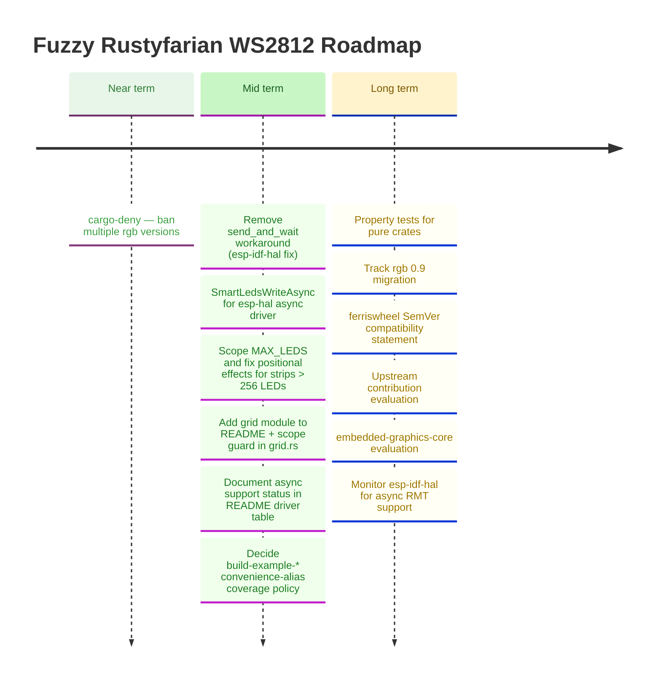

# Roadmap

*Last updated: August 2026*

The April 2026 `esp-hal` release wave (`v0.5.0`) is shipped, the AVR bit-bang
driver is the recommended backend (per ADR 007), the GPIO8 RMT hang is
resolved upstream, and the Xtensa ESP32 / WROOM-32 bare-metal target is
verified clean under `esp-hal 1.1.0`.
All six crates are on crates.io: the pure-logic trio (`bunting`, `pennant`,
`ferriswheel`) since `0.5.0`, and all three driver crates
(`rustyfarian-avr-ws2812`, `rustyfarian-esp-idf-ws2812`,
`rustyfarian-esp-hal-ws2812`) since the `0.6.0` wave.
The 2026-05-05 vision review confirmed AVR as a first-class supported MCU
family and ruled in-workspace networking demos (e.g. ESP-NOW) out of scope.
All three embedded targets (RISC-V, AVR, Xtensa) are now gated in CI by path-filtered
cross-target workflows.
The near-term priority is tightening the `cargo-deny` configuration.
Mid-term priorities are removing the `esp-idf-hal` `send_and_wait` workaround
when the upstream fix lands, `SmartLedsWriteAsync` for the async driver, and
scoping `MAX_LEDS` correctly.
All completed items are documented in the [CHANGELOG](../CHANGELOG.md).



---

## Developer Tooling

### Decide `build-example-*` convenience-alias coverage policy

Alias coverage is arbitrary rather than wrong: 6 `build-example-*` aliases exist for
31 examples, while `just build-example <crate> <name>` and `just flash <name>`
(which infers the crate from the name prefix) already cover all of them.
Decide whether aliases are curated shortcuts for a few common cases — and if so, which —
or should cover every example.

Surfaced as a follow-up while trimming `just --list` to one line per recipe (August 2026);
deliberately left out of that change, which touched descriptions only.

Guard the trimmed output against regression when adding recipes — the name column is padded
to 40, so a description budget of ~59 characters keeps a row under 100:

```sh
just --list | awk '{ print length }' | sort -rn | head -1   # expect <= 100
```

---

## Ecosystem Integration

### Recurring: audit `deny.toml` exceptions

Each ignored advisory or per-crate licence exception in [`deny.toml`](../deny.toml)
should be re-checked periodically — the underlying upstream bug, deprecation, or
licensing situation may have been resolved, in which case the exception can be
removed and the dep graph cleans up.

Current entries (as of 2026-05):

- `RUSTSEC-2024-0436` — `paste` unmaintained; a **direct** dependency of `esp-hal 1.1.2`
  as well as transitive through `riscv 0.15.0`. Bumping `riscv` alone therefore cannot
  clear it — `esp-hal` must drop `paste` first. Re-checked 2026-08-12 against 1.1.2
  (still present); re-run `cargo tree -i paste` after each `esp-hal` bump.

(The `bare-metal` / `atdf2svd` exceptions previously needed for `rustyfarian-avr-ws2812`
were eliminated in `v0.5.0` by switching the bit-bang backend to raw `cli` + `SREG`
save/restore inline asm, dropping the `avr-device` dependency entirely.)

Cadence: revisit at every minor release, or when a new exception is added.
Mechanism: walk each entry, run `cargo update` against the relevant upstream, and
attempt to remove the exception.
If the advisory or licence still fires, leave it in place but refresh the rationale
comment with the current upstream state.

### Add `multiple-versions = "deny"` for `rgb` in `deny.toml`

`ferriswheel` includes a compile-time type-identity assertion that fails the
build if its `rgb` and `smart-leds-trait`'s `rgb` resolve to different versions.
That assertion is belt-and-braces for downstream consumers who don't run `cargo-deny`.
The root-cause prevention is a `[bans]` rule that fails CI before the assertion
ever fires:

```toml
[bans]
multiple-versions = "deny"
# add explicit [[bans.allow]] entries with rationale for any known-safe duplicates
```

Add an explicit `allow` entry for any crate that legitimately ships multiple
versions in the dep graph at the time of the change.

---

## Hardware Driver Improvements

### Document async support status in README driver table

`rustyfarian-esp-hal-ws2812` has an `async` feature with `AsyncStatusLed`.
`rustyfarian-esp-idf-ws2812` does not, and currently a user has to read the
source to discover this.

Add a column or note to the README driver table marking async as esp-hal-only
by design: ESP-IDF users spawn threads; Embassy is the async runtime for
bare-metal only (see ADR 008).
If a future `esp-idf-hal` release adds async RMT (tracked below), this entry
can be updated.

### Remove `send_and_wait` workaround when `esp-idf-hal` fixes `EncoderWrapper`

`esp-idf-hal 0.46.2` has a bug in `EncoderWrapper`: the `From<rmt_encode_state_t>` conversion
panics on bitwise-OR'd flag values (e.g. `COMPLETE | MEM_FULL = 0x03`) that the C encoder
legitimately returns.
Since the encode callback runs in ISR context, the panic triggers `abort()`.
We work around this by using `start_send` + `wait_all_done` directly with the C-side
`BytesEncoder`, bypassing the Rust `EncoderWrapper` entirely.
When a future `esp-idf-hal` release fixes this (likely by treating `rmt_encode_state_t` as
a bitfield rather than an enum), switch back to `send_and_wait` and remove the `transmit_bytes`
helper and its `unsafe` block.
Track: [esp-idf-hal GitHub issues](https://github.com/esp-rs/esp-idf-hal/issues).

### Implement `SmartLedsWriteAsync` for `Ws2812Rmt<'d, Async, N>`

The `smart-leds-trait` ecosystem defines a `SmartLedsWriteAsync` trait for async LED writers.
`rustyfarian-esp-hal-ws2812` already implements `SmartLedsWrite` for the blocking variant.
Adding `SmartLedsWriteAsync` for the async variant completes the `smart-leds` integration
and allows users to apply `brightness()` and `gamma()` adapters in async contexts.
Blocked on: `SmartLedsWriteAsync` trait stabilisation in the `smart-leds` ecosystem.
See [ADR 006](adr/006-async-support.md) and [ADR 008](adr/008-embassy-as-async-runtime.md).

---

## Animation Effects & Pure Crates

The current `ferriswheel` crate provides more than a dozen well-tested, ring-specific effects:
`RainbowEffect`, `PulseEffect`, `BreatheEffect`, `SpinnerEffect`, `MeteorEffect`, `TwinkleEffect`, `FireEffect`, `CylonEffect`, `KnightRiderEffect`, `ChaseEffect`, `FlashEffect`, `ProgressEffect`, `SectionEffect`, and `RainbowCometEffect`.

### Scope `MAX_LEDS` and fix positional effects for strips > 256 LEDs

Two coupled constraints that must move together:

**`MAX_LEDS = 256` is a crate-wide cap** whose rationale (256 distinct hues for `RainbowEffect`)
only applies to that one effect.
For `FireEffect` or `MeteorEffect` on a 300-LED strip — common for room lighting — the limit
is artificial and surprising.
Resolution: move the hue-count rationale to `RainbowEffect::MAX_USEFUL_HUES` and raise or
remove the crate-wide cap.

**`position: u8` in all positional effects** (`SpinnerEffect`, `ChaseEffect`, `RainbowEffect`,
`MeteorEffect`) and in `advance_position` — safe only while `MAX_LEDS ≤ 256`; any increase
silently truncates positions.
Fix: change `advance_position` and all `position` fields to `usize`.

These two items must move together: raising `MAX_LEDS` without fixing the `u8` positions is
a soundness bug.

### Add `grid` module to README crate table and scope guard in `grid.rs`

`bunting` 0.5.0 added `GridBuffer` / `GridLayout` / `GAMMA_2_0`, but the `bunting` row in
the README crate table makes no mention of it.
A user searching for matrix/grid support will look in `ferriswheel` and conclude it doesn't exist.

Two small changes:

1. One sentence in the `bunting` README row: "also provides `grid` — pure data-layout types for matrix displays."
2. A `// SCOPE:` comment at the top of `grid.rs` quoting the VISION non-goal
   ("matrix-first animation vocabulary is out of scope") to guard against feature creep.

### Deferred follow-ups

Small improvements deferred during reviews.
Not blocking, but tracked here to avoid being lost.

- **`MeteorEffect` decay math: `/255` vs fixed-point `>> 8`** — current `brightness * decay / 255`
  maps decay values directly to percentages and keeps `decay=0` = instant black.
  The `* (decay + 1) >> 8` fixed-point variant is marginally faster on bare metal but changes
  the semantics of `decay=0` (near-zero, not instant black), requiring test updates.
  Revisit only if a performance need or a `with_decay_pct(f32)` builder is added.

- **`pennant::PulseEffect::update` takes `(u8, u8, u8)` instead of `RGB8`** — inconsistent with
  the rest of the workspace, which standardises on `rgb::RGB8` (ADR 001).
  Breaking change; align the signature in the next minor bump (0.7.0 candidate).
  At the same time, decide whether `new()` starting at `brightness: 0` (below `min_brightness: 2`)
  is intended fade-in behaviour or should start at `min_brightness` — now documented as fade-in.

- **`#[must_use]` audit for builder and getter methods in the pure crates** — `with_*` builders
  and `Result`-returning constructors silently discard work if the return value is dropped.
  Sweep `bunting`, `pennant`, and `ferriswheel` and add `#[must_use]` where it guards a real mistake.

- **Fixed `[u8; MAX_LEDS]` state arrays in `TwinkleEffect` and `FireEffect`** — a 12-LED ring
  still carries 256-byte heat/brightness arrays (~340-byte structs).
  Acceptable trade-off today; revisit with const-generic sizing if RAM pressure appears on AVR.

- **`impl Effect` delegation boilerplate repeated across all 14 effects** — each effect hand-writes
  the same three-method trait impl delegating to inherent methods (the documented recursion-avoidance
  pattern).
  A small macro could remove ~150 lines; weigh against the readability cost of macro indirection.

- **Tail-length clamping is inconsistent across effects** — `SpinnerEffect::with_tail_length` clamps
  via `min(num_leds)`, `MeteorEffect::new` clamps inline with `6.min(num_leds - 1)`, and a
  `clamp_tail_length` util exists in `util.rs`.
  Consolidate on the util function; behaviour-preserving refactor.

- **Buffer-validation order differs between effects' `update` paths** — most validate via the
  leading `current()` call, `FlashEffect` mutates state after that call.
  All paths are currently correct (validation happens first either way); unify the pattern so the
  invariant is structural rather than incidental.

### FireEffect follow-up

- **Gradient parameterisation** — `with_gradient(&'static [GradientStop])` for users who want a custom palette (e.g. blue ice, purple plasma). Requires a `GradientStop` type and piecewise-linear interpolation in `fire_color`. `no_std`-safe with a fixed-size slice; `Vec` is off the table.

---

## Long-term / Strategic

### Add property tests for pure crates (`bunting`, `pennant`, `ferriswheel`)

The unit tests are good, but for colour math (`hsv_to_rgb`, `lerp_color`, `scale_brightness`)
and effect invariants (e.g. "`update` then `current` returns the same buffer", "`reset` returns
to the same state as a fresh `new()`"), `proptest` or `quickcheck` would catch a class of bugs
that unit tests won't.
The `FireEffect` modulo-bias bug fixed in 0.5.0 is exactly the shape of bug a property test
would surface earlier.
Low urgency — the architecture is already test-friendly on the host target.

### Track `rgb 0.9` migration

`rgb 0.9` redesigns `RGB8` from a struct with public `r`/`g`/`b` fields to a wrapper around
`[u8; 3]` with accessor methods.
The workspace is pinned to `0.8`.
Every downstream consumer that pulls in `rgb 0.9` (via another dep) will hit either a
duplicate-version warning or a hard incompatibility through the type-identity assertion.

Defensible position: "migrate when `esp-hal` moves to `rgb 0.9`."
That position should be explicit rather than implicit.
File a tracking issue; re-evaluate at each `esp-hal` minor release.

### Add SemVer compatibility statement to `ferriswheel`

`ferriswheel` is at `0.5.0` — pre-1.0 in Cargo SemVer means every minor bump can break.
With 14 effects, an `Effect` trait with `PartialEq` derives, and `MAX_LEDS` as public API,
there is real surface area worth committing to before third-party consumers pin the crate.

Add a section to the crate-level rustdoc (or a `STABILITY.md`) along the lines of:

> The `Effect` trait is the stable interface.
> Concrete effect structs may gain new builder methods between minor versions;
> existing builder methods will only be removed in major bumps.
> The `MAX_LEDS` constant is part of the public API.

Do this before publishing `ferriswheel` to new crates.io consumers.

### Evaluate upstream contribution to `smart-leds-rs`

The pure-logic crates (`bunting`, `ferriswheel`) represent a gap in the ecosystem:
no existing `smart-leds-rs` crate provides ring-geometry animations testable without hardware.
Once the APIs are stable, evaluate whether proposing these as upstream additions or companion crates makes sense.
Decision should follow a stability review and user feedback.

### Monitor `esp-idf-hal` for async RMT support

`rustyfarian-esp-idf-ws2812` is blocking-only because `esp-idf-hal 0.46`'s `TxChannelDriver`
has no async API.
If a future `esp-idf-hal` release adds async RMT (likely using `esp-idf-svc`'s executor or
`tokio`, not Embassy), async support can be added to the IDF driver under a separate feature flag.
This would be a different runtime from the HAL driver's Embassy-based async (see [ADR 008](adr/008-embassy-as-async-runtime.md))
— the two drivers already diverge on error handling (ADR 005), so runtime divergence is expected.
Track: [esp-idf-hal releases](https://github.com/esp-rs/esp-idf-hal/releases).

### Evaluate `embedded-graphics-core` integration for matrix displays

`ws2812-esp32-rmt-driver` demonstrated a clean `embedded-graphics-core` drawing target
for addressing LEDs as a 2D pixel grid.
If a matrix display use-case emerges, this pattern provides a ready-made approach.
Not a near-term priority — track as a future option.
