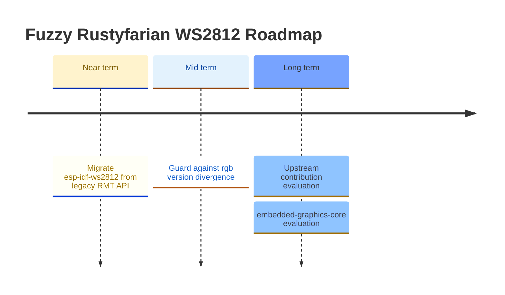

# Roadmap

*Last updated: March 2026*

This roadmap is informed by the [ecosystem comparison](ecosystem-comparison.md) conducted in February 2026.
Items are grouped by theme and ordered roughly by impact and dependency.
Completed items have been moved to the [CHANGELOG](../CHANGELOG.md).

## Ecosystem Integration

### Guard against `rgb` version divergence between `ferriswheel` and `smart-leds-trait`

If `smart-leds-trait` ever bumps to `rgb v0.9`, the two `RGB8` types would silently
diverge and users would see confusing type-mismatch errors at the `SmartLedsWrite`
call site rather than a clean version-conflict at `cargo update` time.
Mitigation: add `smart-leds-trait` as an optional dependency in `ferriswheel`
(e.g. `smart-leds-compat = ["dep:smart-leds-trait"]`).
Cargo would then surface the version conflict at resolve time rather than at the
user's build site.
Purely defensive — not urgent until `smart-leds-trait` signals an `rgb` bump.

---

## Hardware Driver Improvements

### Migrate `rustyfarian-esp-idf-ws2812` from legacy RMT API to new `esp-idf-hal` RMT API

The driver currently uses `esp-idf-hal 0.46` with `features = ["rmt-legacy"]`, enabling
deprecated types: `TransmitConfig`, `TxRmtDriver`, `FixedLengthSignal`,
`VariableLengthSignal`, `Pulse`, `PinState`.
Disabling `rmt-legacy` activates the new RMT API; the driver must be rewritten to use it.

- **Scope**: `crates/rustyfarian-esp-idf-ws2812/src/lib.rs` (~60 lines of RMT logic),
  the workspace `Cargo.toml` (`rmt-legacy` feature removal), and all 12 IDF examples
- **Prerequisite**: research the new `esp-idf-hal 0.46` RMT API surface (signal types,
  configuration, transmission methods) — assign to `research-analyst`
- **Risk**: WS2812 timing is sensitive; must verify signal integrity on hardware after migration

---

## Animation Effects (`ferriswheel`)

The current `ferriswheel` crate provides more than a dozen well-tested, ring-specific effects:
`RainbowEffect`, `PulseEffect`, `BreatheEffect`, `SpinnerEffect`, `MeteorEffect`, `TwinkleEffect`, `FireEffect`, `CylonEffect`, `KnightRiderEffect`, `ChaseEffect`, `FlashEffect`, `ProgressEffect`, `SectionEffect`, and `RainbowCometEffect`.

### Deferred follow-ups

Small improvements deferred during reviews.
Not blocking, but tracked here to avoid being lost.

- **`PartialEq` derive on effect structs** — `BreatheEffect` (and `PulseEffect`) do not derive
  `PartialEq`, making test assertions verbose.
  Low priority; consistent with current `PulseEffect` behaviour; fix both at the same time.

- **Oversized-buffer acceptance test** — all effects silently accept buffers larger than
  `num_leds` and write only the first `num_leds` entries.
  This is intentional but untested.
  Add a shared contract test (or per-effect test) that confirms oversized buffers are accepted
  and only the required LEDs are written.

- **`MeteorEffect` decay math: `/255` vs fixed-point `>> 8`** — current `brightness * decay / 255`
  maps decay values directly to percentages and keeps `decay=0` = instant black.
  The `* (decay + 1) >> 8` fixed-point variant is marginally faster on bare metal but changes
  the semantics of `decay=0` (near-zero, not instant black), requiring test updates.
  Revisit only if a performance need or a `with_decay_pct(f32)` builder is added.

- **`position: u8` hidden constraint in all positional effects** — `SpinnerEffect`, `ChaseEffect`,
  `RainbowEffect`, and `MeteorEffect` all store `position: u8`; `advance_position` also returns `u8`.
  With `MAX_LEDS = 256` the cast is lossless today (positions 0-255 map exactly), but raising
  `MAX_LEDS` above 256 would silently truncate.
  Fix is crate-wide: change `advance_position` + all four `position` fields to `usize`.
  Not urgent until `MAX_LEDS` increases.

### FireEffect follow-ups

Small improvements identified during review. Not blocking, tracked to avoid being lost.

- **Parameterise ignition base range** — `with_base_range(u8)` builder; currently hardcoded to `n.min(3)`, which is fine for small rings but too narrow for long strips (60+ LEDs). A proportional default (e.g. `(n / 10).max(3)`) or explicit setter would make large-strip fire look more natural.

- **Ring wrap-around diffusion** — `with_wrap(bool)` flag to feed `heat[n-1]` back into `heat[0]` during diffusion, enabling a true circular topology where the "tip" and "base" are adjacent. Changes the visual character significantly — the current linear model (base at index 0) is correct for a strip; wrap-around suits a true ring where the flame is symmetric.

- **Gradient parameterisation** — `with_gradient(&'static [GradientStop])` for users who want a custom palette (e.g. blue ice, purple plasma). Requires a `GradientStop` type and piecewise-linear interpolation in `fire_color`. `no_std`-safe with a fixed-size slice; `Vec` is off the table.

---

## Long-term / Strategic

### Evaluate upstream contribution to `smart-leds-rs`

The pure-logic crates (`ws2812-pure`, `ferriswheel`) represent a gap in the ecosystem:
no existing `smart-leds-rs` crate provides ring-geometry animations testable without hardware.
Once the APIs are stable, evaluate whether proposing these as upstream additions or companion crates makes sense.
Decision should follow a stability review and user feedback.

### Evaluate `embedded-graphics-core` integration for matrix displays

`ws2812-esp32-rmt-driver` demonstrated a clean `embedded-graphics-core` drawing target
for addressing LEDs as a 2D pixel grid.
If a matrix display use-case emerges, this pattern provides a ready-made approach.
Not a near-term priority — track as a future option.
