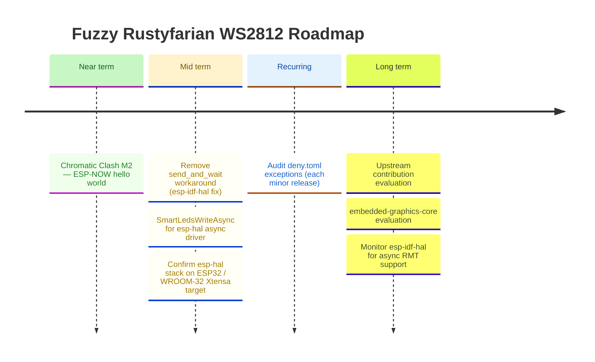

# Roadmap

*Last updated: May 2026*

The April 2026 `esp-hal` release wave (`v0.5.0`) is shipped, the AVR bit-bang
driver is the recommended backend (per ADR 007), and the GPIO8 RMT hang is
resolved upstream.
Near-term focus is the Chromatic Clash demo (M2 — ESP-NOW hello world).
Mid-term priorities are removing the `esp-idf-hal` `send_and_wait` workaround
when the upstream fix lands and `SmartLedsWriteAsync` for the async driver.
All completed items are documented in the [CHANGELOG](../CHANGELOG.md).

## Ecosystem Integration

### Recurring: audit `deny.toml` exceptions

Each ignored advisory or per-crate license exception in [`deny.toml`](../deny.toml)
should be re-checked periodically — the underlying upstream bug, deprecation, or
licensing situation may have been resolved, in which case the exception can be
removed and the dep graph cleans up.

Current entries (as of 2026-05):

- `RUSTSEC-2024-0436` — `paste` unmaintained; transitive through `esp-hal 1.1.0` /
  `riscv 0.15.0`. Re-check when those crates bump or when a successor proc-macro
  ships in the smart-leds / esp-rs ecosystem.

(The `bare-metal` / `atdf2svd` exceptions previously needed for `rustyfarian-avr-ws2812`
were eliminated in `v0.5.0` by switching the bit-bang backend to raw `cli` + `SREG`
save/restore inline asm, dropping the `avr-device` dependency entirely.)

Cadence: revisit at every minor release, or when a new exception is added.
Mechanism: walk each entry, run `cargo update` against the relevant upstream, and
attempt to remove the exception. If the advisory or licence still fires, leave it
in place but refresh the rationale comment with the current upstream state.

---

## Hardware Driver Improvements

### Confirm `esp-hal` stack on the ESP32 / WROOM-32 Xtensa target

The April 2026 `esp-hal` upgrade (`v0.5.0`) was verified on the RISC-V targets
(C3 / C6) but not on the Xtensa target — the local toolchain didn't have the
Xtensa core installed when the release was cut.
Run `just check-hal-xtensa` (or the equivalent `cargo check --target xtensa-esp32-none-elf`
under the `esp` toolchain) to close the open question recorded in
[`docs/features/esp-hal-stack-upgrade-april-2026-v1.md`](features/esp-hal-stack-upgrade-april-2026-v1.md)
"Open Questions".
If breakage surfaces, file follow-up work; if it builds clean, mark the open
question resolved and archive the feature doc.

### Remove `send_and_wait` workaround when `esp-idf-hal` fixes `EncoderWrapper`

`esp-idf-hal 0.46.2` has a bug in `EncoderWrapper`: the `From<rmt_encode_state_t>` conversion
panics on bitwise-OR'd flag values (e.g. `COMPLETE | MEM_FULL = 0x03`) that the C encoder
legitimately returns.
Since the encode callback runs in ISR context, the panic triggers `abort()`.
We work around this by using `start_send` + `wait_all_done` directly with the C-side
`BytesEncoder`, bypassing the Rust `EncoderWrapper` entirely.
When a future `esp-idf-hal` release fixes this (likely by treating `rmt_encode_state_t` as
a bitfield rather than an enum), switch back to `send_and_wait` and remove the `transmit_bytes`
helper and its `unsafe` block.
Track: [esp-idf-hal GitHub issues](https://github.com/esp-rs/esp-idf-hal/issues).

### Implement `SmartLedsWriteAsync` for `Ws2812Rmt<'d, Async, N>`

The `smart-leds-trait` ecosystem defines a `SmartLedsWriteAsync` trait for async LED writers.
`rustyfarian-esp-hal-ws2812` already implements `SmartLedsWrite` for the blocking variant.
Adding `SmartLedsWriteAsync` for the async variant completes the `smart-leds` integration
and allows users to apply `brightness()` and `gamma()` adapters in async contexts.
Blocked on: `SmartLedsWriteAsync` trait stabilisation in the `smart-leds` ecosystem.
See [ADR 006](adr/006-async-support.md) and [ADR 008](adr/008-embassy-as-async-runtime.md).

---

## Animation Effects (`ferriswheel`)

The current `ferriswheel` crate provides more than a dozen well-tested, ring-specific effects:
`RainbowEffect`, `PulseEffect`, `BreatheEffect`, `SpinnerEffect`, `MeteorEffect`, `TwinkleEffect`, `FireEffect`, `CylonEffect`, `KnightRiderEffect`, `ChaseEffect`, `FlashEffect`, `ProgressEffect`, `SectionEffect`, and `RainbowCometEffect`.

### Deferred follow-ups

Small improvements deferred during reviews.
Not blocking, but tracked here to avoid being lost.

- **`MeteorEffect` decay math: `/255` vs fixed-point `>> 8`** — current `brightness * decay / 255`
  maps decay values directly to percentages and keeps `decay=0` = instant black.
  The `* (decay + 1) >> 8` fixed-point variant is marginally faster on bare metal but changes
  the semantics of `decay=0` (near-zero, not instant black), requiring test updates.
  Revisit only if a performance need or a `with_decay_pct(f32)` builder is added.

- **`position: u8` hidden constraint in all positional effects** — `SpinnerEffect`, `ChaseEffect`,
  `RainbowEffect`, and `MeteorEffect` all store `position: u8`; `advance_position` also returns `u8`.
  With `MAX_LEDS = 256` the cast is lossless today (positions 0-255 map exactly), but raising
  `MAX_LEDS` above 256 would silently truncate.
  Fix is crate-wide: change `advance_position` + all four `position` fields to `usize`.
  Not urgent until `MAX_LEDS` increases.

### FireEffect follow-up

- **Gradient parameterisation** — `with_gradient(&'static [GradientStop])` for users who want a custom palette (e.g. blue ice, purple plasma). Requires a `GradientStop` type and piecewise-linear interpolation in `fire_color`. `no_std`-safe with a fixed-size slice; `Vec` is off the table.

---

## Long-term / Strategic

### Evaluate upstream contribution to `smart-leds-rs`

The pure-logic crates (`ws2812-pure`, `ferriswheel`) represent a gap in the ecosystem:
no existing `smart-leds-rs` crate provides ring-geometry animations testable without hardware.
Once the APIs are stable, evaluate whether proposing these as upstream additions or companion crates makes sense.
Decision should follow a stability review and user feedback.

### Monitor `esp-idf-hal` for async RMT support

`rustyfarian-esp-idf-ws2812` is blocking-only because `esp-idf-hal 0.46`'s `TxChannelDriver`
has no async API.
If a future `esp-idf-hal` release adds async RMT (likely using `esp-idf-svc`'s executor or
`tokio`, not Embassy), async support can be added to the IDF driver under a separate feature flag.
This would be a different runtime from the HAL driver's Embassy-based async (see [ADR 008](adr/008-embassy-as-async-runtime.md))
— the two drivers already diverge on error handling (ADR 005), so runtime divergence is expected.
Track: [esp-idf-hal releases](https://github.com/esp-rs/esp-idf-hal/releases).

### Evaluate `embedded-graphics-core` integration for matrix displays

`ws2812-esp32-rmt-driver` demonstrated a clean `embedded-graphics-core` drawing target
for addressing LEDs as a 2D pixel grid.
If a matrix display use-case emerges, this pattern provides a ready-made approach.
Not a near-term priority — track as a future option.
