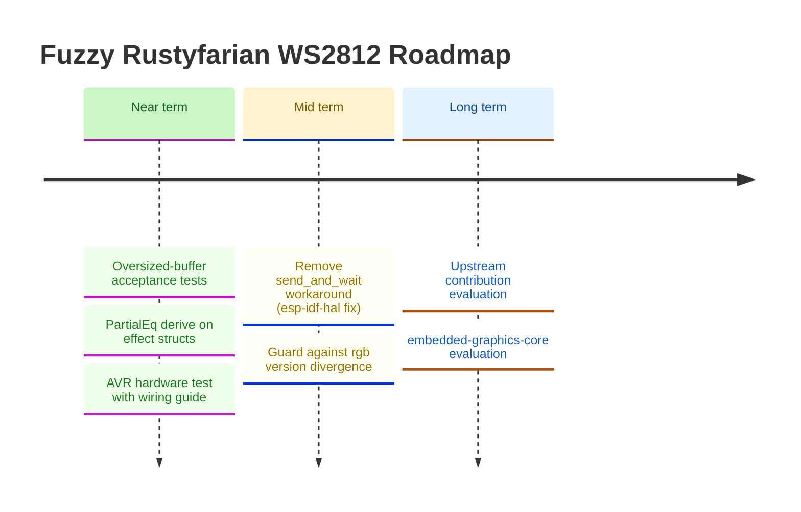

# Roadmap

*Last updated: March 2026*

This roadmap is informed by the [ecosystem comparison](ecosystem-comparison.md) conducted in February 2026.
The AVR WS2812 driver (`rustyfarian-avr-ws2812`) was completed in March 2026 across three phases:
SPI encoding in `ws2812-pure`, the `embedded-hal 1.0` hardware wrapper, and build validation against `avr-none`.
Near-term focus shifts to code quality follow-ups and real-hardware validation.

## Ecosystem Integration

### Guard against `rgb` version divergence between `ferriswheel` and `smart-leds-trait`

If `smart-leds-trait` ever bumps to `rgb v0.9`, the two `RGB8` types would silently
diverge and users would see confusing type-mismatch errors at the `SmartLedsWrite`
call site rather than a clean version-conflict at `cargo update` time.
Mitigation: add `smart-leds-trait` as an optional dependency in `ferriswheel`
(e.g. `smart-leds-compat = ["dep:smart-leds-trait"]`).
Cargo would then surface the version conflict at resolve time rather than at the
user's build site.
Purely defensive — not urgent until `smart-leds-trait` signals an `rgb` bump.

---

## Hardware Driver Improvements

### Remove `send_and_wait` workaround when `esp-idf-hal` fixes `EncoderWrapper`

`esp-idf-hal 0.46.2` has a bug in `EncoderWrapper`: the `From<rmt_encode_state_t>` conversion
panics on bitwise-OR'd flag values (e.g. `COMPLETE | MEM_FULL = 0x03`) that the C encoder
legitimately returns.
Since the encode callback runs in ISR context, the panic triggers `abort()`.
We work around this by using `start_send` + `wait_all_done` directly with the C-side
`BytesEncoder`, bypassing the Rust `EncoderWrapper` entirely.
When a future `esp-idf-hal` release fixes this (likely by treating `rmt_encode_state_t` as
a bitfield rather than an enum), switch back to `send_and_wait` and remove the `transmit_bytes`
helper and its `unsafe` block.
Track: [esp-idf-hal GitHub issues](https://github.com/esp-rs/esp-idf-hal/issues).

---

## Animation Effects (`ferriswheel`)

The current `ferriswheel` crate provides more than a dozen well-tested, ring-specific effects:
`RainbowEffect`, `PulseEffect`, `BreatheEffect`, `SpinnerEffect`, `MeteorEffect`, `TwinkleEffect`, `FireEffect`, `CylonEffect`, `KnightRiderEffect`, `ChaseEffect`, `FlashEffect`, `ProgressEffect`, `SectionEffect`, and `RainbowCometEffect`.

### Deferred follow-ups

Small improvements deferred during reviews.
Not blocking, but tracked here to avoid being lost.

- **`PartialEq` derive on effect structs** — `BreatheEffect` (and `PulseEffect`) do not derive
  `PartialEq`, making test assertions verbose.
  Low priority; consistent with current `PulseEffect` behaviour; fix both at the same time.

- **Oversized-buffer acceptance test** — all effects silently accept buffers larger than
  `num_leds` and write only the first `num_leds` entries.
  This is intentional but untested.
  Add a shared contract test (or per-effect test) that confirms oversized buffers are accepted
  and only the required LEDs are written.

- **`MeteorEffect` decay math: `/255` vs fixed-point `>> 8`** — current `brightness * decay / 255`
  maps decay values directly to percentages and keeps `decay=0` = instant black.
  The `* (decay + 1) >> 8` fixed-point variant is marginally faster on bare metal but changes
  the semantics of `decay=0` (near-zero, not instant black), requiring test updates.
  Revisit only if a performance need or a `with_decay_pct(f32)` builder is added.

- **`position: u8` hidden constraint in all positional effects** — `SpinnerEffect`, `ChaseEffect`,
  `RainbowEffect`, and `MeteorEffect` all store `position: u8`; `advance_position` also returns `u8`.
  With `MAX_LEDS = 256` the cast is lossless today (positions 0-255 map exactly), but raising
  `MAX_LEDS` above 256 would silently truncate.
  Fix is crate-wide: change `advance_position` + all four `position` fields to `usize`.
  Not urgent until `MAX_LEDS` increases.

### FireEffect follow-ups

Small improvements identified during review. Not blocking, tracked to avoid being lost.

- **Parameterise ignition base range** — `with_base_range(u8)` builder; currently hardcoded to `n.min(3)`, which is fine for small rings but too narrow for long strips (60+ LEDs). A proportional default (e.g. `(n / 10).max(3)`) or explicit setter would make large-strip fire look more natural.

- **Ring wrap-around diffusion** — `with_wrap(bool)` flag to feed `heat[n-1]` back into `heat[0]` during diffusion, enabling a true circular topology where the "tip" and "base" are adjacent. Changes the visual character significantly — the current linear model (base at index 0) is correct for a strip; wrap-around suits a true ring where the flame is symmetric.

- **Gradient parameterisation** — `with_gradient(&'static [GradientStop])` for users who want a custom palette (e.g. blue ice, purple plasma). Requires a `GradientStop` type and piecewise-linear interpolation in `fire_color`. `no_std`-safe with a fixed-size slice; `Vec` is off the table.

---

## Long-term / Strategic

### Evaluate upstream contribution to `smart-leds-rs`

The pure-logic crates (`ws2812-pure`, `ferriswheel`) represent a gap in the ecosystem:
no existing `smart-leds-rs` crate provides ring-geometry animations testable without hardware.
Once the APIs are stable, evaluate whether proposing these as upstream additions or companion crates makes sense.
Decision should follow a stability review and user feedback.

### ATmega328P / AVR WS2812 support (`rustyfarian-avr-ws2812`) — Complete

A third hardware driver targeting `avr-none` (with `-C target-cpu=atmega328p`) using the SPI
prerendered approach (no inline assembly required).
See [AVR WS2812 Research](research-avr-ws2812.md) for the full feasibility assessment.

**Phased approach:**

1. ~~**Add `prerender_spi` to `ws2812-pure`**~~ — **Done.**
   Pure `no_std` function encoding `&[RGB8]` into a WS2812 SPI byte buffer (`12 × num_leds` bytes, reset sent separately).
   Includes `spi_data_len()`, `SpiEncodeError`, `SPI_RESET_BYTES_2MHZ`, and 14 unit tests + 1 doc test.
2. ~~**Add `rustyfarian-avr-ws2812`**~~ — **Done.**
   Thin wrapper holding an `embedded-hal 1.0` `SpiBus`, calling `prerender_spi`.
   Generic over `SpiBus`; caller wraps in `avr_device::interrupt::free` at the call site.
   Includes `Ws2812Spi`, `SpiError`, `spi_buffer_size`, 7 unit tests + 1 doc test.
3. ~~**AVR CI / build validation**~~ — **Done.**
   `just check-avr` (host), `just check-avr-target` (real `avr-none` with `-C target-cpu=atmega328p`).
   Setup recipes: `just setup-avr` installs `nightly-2025-04-27` + `rust-src`.
   `just setup` installs all targets and tools.

**Key constraints:**
- Permanent nightly dependency (Tier 3 target, no stable path)
- GNU AVR toolchain required (`avr-gcc`, `avr-binutils`, `avr-libc`)
- 2 KB SRAM limits practical LED count (~60 LEDs max, 12-LED ring is comfortable at 144 bytes)
- `ws2812-spi` still targets `embedded-hal 0.2`; `avr-hal` is on 1.0 — version mismatch means
  implementing SPI encoding ourselves (in `ws2812-pure`) rather than depending on `ws2812-spi`

**Do not adopt:** `ws2812-avr` (GPL, unstable `generic_const_exprs`, near-zero maintenance).
**Do not attempt:** pure-Rust bitbang without assembly — timing margins too tight at 16 MHz.

### AVR hardware test with wiring guide

End-to-end validation of `rustyfarian-avr-ws2812` on real hardware.
Deliverables:

- **Wiring guide** (`docs/avr-wiring.md`) — schematic and pin connections for ATmega328P + WS2812
  12-LED ring: SPI MOSI (PB3/D11) → DIN, 5V power, level shifting (3.3V logic → 5V data),
  decoupling capacitor.
- **Flashing guide** — how to compile for AVR, flash via `avrdude` (USBasp or Arduino-as-ISP),
  and verify output. Include the exact `cargo` + `avr-objcopy` + `avrdude` pipeline.
- **Minimal example** (`examples/avr_rainbow.rs` or similar) — a working blinky/rainbow using
  `avr-hal`'s SPI driver with `Ws2812Spi`, demonstrating the full stack from `ferriswheel`
  effect → `prerender_spi` → SPI hardware → LEDs.
- **Smoke test confirmation** — document observed behaviour (correct colours, timing, no
  flicker) and any adjustments needed.

Requires physical hardware: ATmega328P board (Arduino Nano/Uno), WS2812 ring, USBasp programmer.

### Evaluate `embedded-graphics-core` integration for matrix displays

`ws2812-esp32-rmt-driver` demonstrated a clean `embedded-graphics-core` drawing target
for addressing LEDs as a 2D pixel grid.
If a matrix display use-case emerges, this pattern provides a ready-made approach.
Not a near-term priority — track as a future option.

---

<strong>Completed</strong>

- **AVR CI / build validation** (AVR Phase 3) — `just check-avr-target` validates real `avr-none` compilation with `nightly-2025-04-27`. Setup recipes: `just setup-avr`, `just setup-hal`, `just setup` (all targets + tools).
- **Add `rustyfarian-avr-ws2812`** (AVR Phase 2) — WS2812 SPI driver using `embedded-hal 1.0` `SpiBus`, generic over any SPI bus. `Ws2812Spi`, `SpiError`, `spi_buffer_size`, 7 unit tests + 1 doc test.
- **Add `prerender_spi` to `ws2812-pure`** (AVR Phase 1) — pure `no_std` SPI encoding function with `spi_data_len()`, `SpiEncodeError`, `SPI_RESET_BYTES_2MHZ` constant, and 14 unit tests + 1 doc test. Unblocks Phase 2 hardware wrapper.
- **Migrate `rustyfarian-esp-idf-ws2812` from legacy RMT API to new `esp-idf-hal` RMT API** — migrated from `rmt-legacy` to `esp-idf-hal 0.46` RMT API using `BytesEncoder`. See [CHANGELOG](../CHANGELOG.md) `[0.4.0]`.

