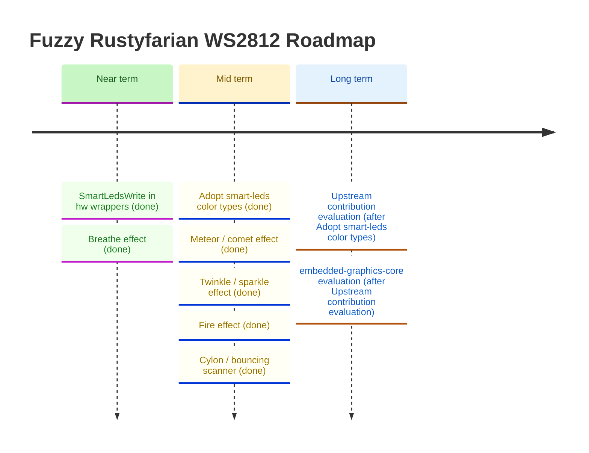

# Roadmap

*Last updated: March 2026*

This roadmap is informed by the [ecosystem comparison](ecosystem-comparison.md) conducted in February 2026.
Items are grouped by theme and ordered roughly by impact and dependency.
Vision review (March 2026) refocused near-term priority on `NoLed` → `esp-hal` driver → ecosystem integration.
`NoLed`, the `esp-hal` driver, `SmartLedsWrite`, `BreatheEffect`, `MeteorEffect`, `TwinkleEffect`, and `FireEffect` are now complete; mid-term focus is on `Cylon / bouncing scanner` next.

## Ecosystem Integration

<strong>Implement <code>SmartLedsWrite</code> in hardware wrapper crates ✓ done</strong>

`SmartLedsWrite` is now implemented in both `rustyfarian-esp-hal-ws2812` and `rustyfarian-esp-idf-ws2812`,
enabling use of the `brightness()` and `gamma()` iterator adapters from the `smart-leds` crate without any conversion code.
See the [Unreleased] CHANGELOG entry for details.

### Adopt `smart-leds-trait` color types in pure crates ✓ done

`smart-leds-trait v0.3.2` and `ferriswheel` both depend on `rgb v0.8` — the same
crate at the same version — so `rgb::RGB8` is already the same type on both sides.
No conversion or adapter code is needed.
The `idf_c6_smart_leds` and `hal_c6_smart_leds` examples confirm this empirically:
effect buffer output feeds directly into `SmartLedsWrite::write()` with zero glue.

Two small follow-on items are tracked below.

### Re-export `RGB8` from `ferriswheel` ✓ done

`pub use rgb::RGB8` added to `ferriswheel::lib`; callers can now write
`use ferriswheel::RGB8` without a direct `rgb` dependency.

### Guard against `rgb` version divergence between `ferriswheel` and `smart-leds-trait`

If `smart-leds-trait` ever bumps to `rgb v0.9`, the two `RGB8` types would silently
diverge and users would see confusing type-mismatch errors at the `SmartLedsWrite`
call site rather than a clean version-conflict at `cargo update` time.
Mitigation: add `smart-leds-trait` as an optional dependency in `ferriswheel`
(e.g. `smart-leds-compat = ["dep:smart-leds-trait"]`).
Cargo would then surface the version conflict at resolve time rather than at the
user's build site.
Purely defensive — not urgent until `smart-leds-trait` signals an `rgb` bump.

---

## Hardware Driver Improvements

<strong>Completed hardware driver items (v0.2.0 – v0.3.0)</strong>

**Implement `rustyfarian-esp-hal-ws2812` driver ✓ done (v0.3.0)**

Full WS2812 RMT driver using `esp-hal 1.0.0`, targeting ESP32-C6 (RISC-V, `riscv32imac-unknown-none-elf`), bare-metal `no_std`.
All color logic delegates to `ws2812-pure`; const-generic `N` buffer sizing was absorbed from the compile-time sizing item.

**Compile-time buffer sizing in the ESP-HAL wrapper ✓ absorbed into driver (v0.3.0)**

`buffer_size(num_leds)` const helper and `const N: usize` generic parameter ship as part of the driver.
Sizing errors are caught at compile time.

**Implement `NoLed` stub in `led-effects` ✓ done (v0.2.0)**

`NoLed` is a zero-size `StatusLed` implementor with `type Error = Infallible`,
satisfying the trait in applications that have no physical status LED.
See the v0.2.0 CHANGELOG entry for details.

---

## Animation Effects (`ferriswheel`)

The current `ferriswheel` crate provides eleven well-tested, ring-specific effects:
`RainbowEffect`, `PulseEffect`, `BreatheEffect`, `SpinnerEffect`, `MeteorEffect`, `TwinkleEffect`, `FireEffect`, `ChaseEffect`, `FlashEffect`, `ProgressEffect`, and `SectionEffect`.
The ecosystem survey identified the following as good candidates for the backlog —
each would need ring-geometry-aware implementation and full test coverage.

### Breathe effect ✓ done

A smooth, symmetric sinusoidal brightness envelope applied to a solid color.
`BreatheEffect` uses a full-wave sine: brightness rises continuously to the peak and descends symmetrically back to the minimum with no pause at the floor.
`PulseEffect` uses a half-wave rectified sine, which produces a heartbeat character — brightness rises to the peak, falls to zero, then *pauses at zero* for roughly a quarter of the cycle before rising again.

### Deferred follow-ups from BreatheEffect review

Small improvements deferred during the BreatheEffect review.
Not blocking, but tracked here to avoid being lost.

- **`current_brightness` underflow when `min > max`** ✓ done — `BreatheEffect` and `PulseEffect`
  now clamp via `u8::min`/`u8::max` before the range arithmetic; inverted ranges are
  treated identically to the correct order.

- **`PartialEq` derive on effect structs** — `BreatheEffect` (and `PulseEffect`) do not derive
  `PartialEq`, making test assertions verbose.
  Low priority; consistent with current `PulseEffect` behaviour; fix both at the same time.

- **Oversized-buffer acceptance test** — all effects silently accept buffers larger than
  `num_leds` and write only the first `num_leds` entries.
  This is intentional but untested.
  Add a shared contract test (or per-effect test) that confirms oversized buffers are accepted
  and only the required LEDs are written.

- **`PulseEffect` doc says "breathing cycle"** ✓ done — renamed to "pulse cycle" in `set_color` rustdoc.

- **`MeteorEffect` decay math: `/255` vs fixed-point `>> 8`** — current `brightness * decay / 255`
  maps decay values directly to percentages and keeps `decay=0` = instant black.
  The `* (decay + 1) >> 8` fixed-point variant is marginally faster on bare metal but changes
  the semantics of `decay=0` (near-zero, not instant black), requiring test updates.
  Revisit only if a performance need or a `with_decay_pct(f32)` builder is added.

- **`position: u8` hidden constraint in all positional effects** — `SpinnerEffect`, `ChaseEffect`,
  `RainbowEffect`, and `MeteorEffect` all store `position: u8`; `advance_position` also returns `u8`.
  With `MAX_LEDS = 256` the cast is lossless today (positions 0–255 map exactly), but raising
  `MAX_LEDS` above 256 would silently truncate.
  Fix is crate-wide: change `advance_position` + all four `position` fields to `usize`.
  Not urgent until `MAX_LEDS` increases.

### Fire effect ✓ done

Heat-map simulation: the base (index 0) sparks randomly, heat diffuses upward via a weighted three-point average, and each LED maps through a black → dark red → orange → yellow gradient.
Configurable `cooling`, `sparking`, and PRNG seed.

### FireEffect follow-ups

Small improvements identified during review. Not blocking, tracked to avoid being lost.

- **Parameterise ignition base range** — `with_base_range(u8)` builder; currently hardcoded to `n.min(3)`, which is fine for small rings but too narrow for long strips (60+ LEDs). A proportional default (e.g. `(n / 10).max(3)`) or explicit setter would make large-strip fire look more natural.

- **Ring wrap-around diffusion** — `with_wrap(bool)` flag to feed `heat[n-1]` back into `heat[0]` during diffusion, enabling a true circular topology where the "tip" and "base" are adjacent. Changes the visual character significantly — the current linear model (base at index 0) is correct for a strip; wrap-around suits a true ring where the flame is symmetric.

- **Gradient parameterisation** — `with_gradient(&'static [GradientStop])` for users who want a custom palette (e.g. blue ice, purple plasma). Requires a `GradientStop` type and piecewise-linear interpolation in `fire_color`. `no_std`-safe with a fixed-size slice; `Vec` is off the table.

### Meteor / comet effect ✓ done

A bright head LED travels around the ring with an exponentially-decaying tail
that fades to black — distinct from `SpinnerEffect`'s linear fade with brightness floor.
Configurable `decay` factor (0–255 per step), `tail_length`, `speed`, and `direction`.
`set_color()` updates the color without resetting the travel position.

### Twinkle / sparkle effect ✓ done

Random LEDs briefly illuminate at peak brightness then decay.
Good for ambient/idle states.
`TwinkleEffect` uses a built-in xorshift32 PRNG (no external dependency) to select which LED fires each tick.
Configurable `spawn_chance` (0 = never, 255 = always, 1–254 = probabilistic), `decay`, `max_brightness`, and PRNG `seed` for reproducible sequences.

### Cylon / bouncing scanner effect ✓ done

A single bright LED sweeps back and forth across the ring, automatically reversing direction.
Note: `ChaseEffect` already covers unidirectional scanning; this adds the auto-bounce behaviour.

### Knight Rider / dual-headed scanner

Two `CylonEffect`-style heads travel in opposite directions, crossing in the middle and reversing independently at each end.
Produces a more complex, symmetric scan pattern.
Can be implemented as a dedicated `KnightRiderEffect` or as a convenience wrapper composing two `CylonEffect` instances into a shared buffer.

### Rainbow-fade tail

A scanner or comet variant where the tail cycles through hue rather than fading to black — each tail LED is offset in hue from the previous one.
Could be a standalone `RainbowCometEffect` or a `with_rainbow_tail()` builder option on `MeteorEffect`/`CylonEffect`; the standalone effect is simpler to test and document.

---

## Long-term / Strategic

### Evaluate upstream contribution to `smart-leds-rs`

The pure-logic crates (`ws2812-pure`, `ferriswheel`) represent a gap in the ecosystem:
no existing `smart-leds-rs` crate provides ring-geometry animations testable without hardware.
Once the APIs are stable, evaluate whether proposing these as upstream additions or companion crates makes sense.
Decision should follow a stability review and user feedback.

### Evaluate `embedded-graphics-core` integration for matrix displays

`ws2812-esp32-rmt-driver` demonstrated a clean `embedded-graphics-core` drawing target
for addressing LEDs as a 2D pixel grid.
If a matrix display use-case emerges, this pattern provides a ready-made approach.
Not a near-term priority — track as a future option.
