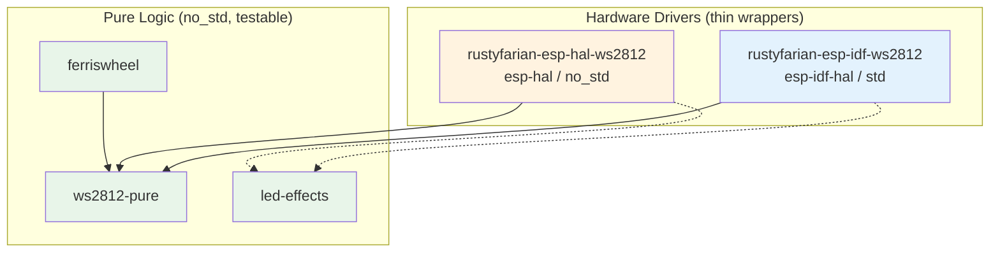

# ADR 005: Dual-HAL Strategy

## Status

Accepted (crate names updated, see [Naming Update](#naming-update) below)

## Context

The ESP Rust ecosystem offers two HAL approaches:

- **`esp-idf-hal`** (std) — builds on ESP-IDF/FreeRTOS, provides a full POSIX-like environment with threads, networking, and `std` support.
- **`esp-hal`** (no_std) — bare-metal, no OS, no allocator required. Lighter footprint, faster boot, deterministic timing.

The workspace currently has one hardware driver crate (`esp32-ws2812-rmt`) that is coupled to `esp-idf-hal`.
All pure logic crates (`ws2812-pure`, `ferriswheel`, `led-effects`) are already `no_std`.
To serve both communities, we need to support both HALs.

The current crate name `esp32-ws2812-rmt` is also misleading: it implies ESP32-specific hardware, but the crate uses ESP-IDF APIs that work across all ESP32 variants (C3, C6, S2, S3, etc.).

The esp-rs ecosystem uses a naming convention where the HAL prefix signals the target environment:

| Prefix                 | Environment         | Example crates               |
|:-----------------------|:--------------------|:-----------------------------|
| `esp-idf-*`            | ESP-IDF (std)       | `esp-idf-hal`, `esp-idf-svc` |
| `esp-hal-*` or `esp-*` | Bare-metal (no_std) | `esp-hal`, `esp-wifi`        |

## Decision

Adopt a **separate-crates** strategy with one thin driver crate per HAL:

| Crate                                                  | HAL           | `std`/`no_std`  |
|:-------------------------------------------------------|:--------------|:----------------|
| `rustyfarian-esp-idf-ws2812` (renamed from `esp32-ws2812-rmt`) | `esp-idf-hal` | `std`           |
| `rustyfarian-esp-hal-ws2812` (new)                             | `esp-hal`     | `no_std`        |

Both crates share the same pure-logic dependencies (`ws2812-pure`, `led-effects`) and expose a similar API surface.

### Architecture

Dashed arrows indicate optional dependencies (behind feature flags).

### Error handling divergence

The two HALs require different error handling strategies:

- **`rustyfarian-esp-idf-ws2812`** uses `anyhow::Result` — appropriate for `std` environments where dynamic error context is cheap.
- **`rustyfarian-esp-hal-ws2812`** uses a custom `Error` enum — required for `no_std` where `anyhow` is not available.

Both crates implement `StatusLed` from `led-effects`, which uses an associated `Error` type, so the trait unifies them at the consumer level.

### Why separate crates instead of feature flags

A single crate with `esp-idf` / `esp-hal` feature flags would:

- Create mutual exclusion complexity (both HALs cannot coexist in a single build target)
- Confuse dependency resolution when different workspace members need different HALs
- Make `cargo check` require the correct target for whichever HAL is active

Separate crates keep each driver independently buildable and testable.

## Consequences

### Positive

- **Clear ecosystem alignment** — crate names use a `rustyfarian-esp-` prefix to avoid confusion with official esp-rs crates, while embedding the HAL name to signal the target environment
- **Independent buildability** — each driver crate can be checked and tested without the other's toolchain
- **Shared pure logic** — color conversion, animations, and status traits are reused across both drivers
- **No breaking API** — downstream `esp-idf-hal` users update only the crate name in `Cargo.toml` and `use` statements

### Negative

- **Two crates to maintain** — driver bugs may need fixing in both (mitigated by keeping drivers thin)
- **API drift risk** — the two drivers could diverge over time (mitigated by shared `StatusLed` trait and similar method signatures)
- **Workspace complexity** — `esp-hal` and `esp-idf-hal` cannot coexist in the same build target, so CI must build each driver separately

## Naming Update

The driver crates were renamed twice:

| Stage | ESP-IDF crate | esp-hal crate |
|:------|:--------------|:--------------|
| Initial | `esp32-ws2812-rmt` | (did not exist) |
| ADR 005 (dual-HAL) | `esp-idf-ws2812-rmt` | `esp-hal-ws2812-rmt` |
| Current | `rustyfarian-esp-idf-ws2812` | `rustyfarian-esp-hal-ws2812` |

The second rename (to `rustyfarian-esp-*`) was motivated by community feedback: the `esp-idf-*` and `esp-hal-*` prefixes are strongly associated with the official esp-rs organization.
Using them for third-party crates causes namespace confusion and risks future naming conflicts.
The `rustyfarian-` org prefix clearly identifies these as third-party crates, following the community norm of prefixing with the project/org name.
The `-rmt` suffix was also dropped as an implementation detail (retained in `keywords` for discoverability).
